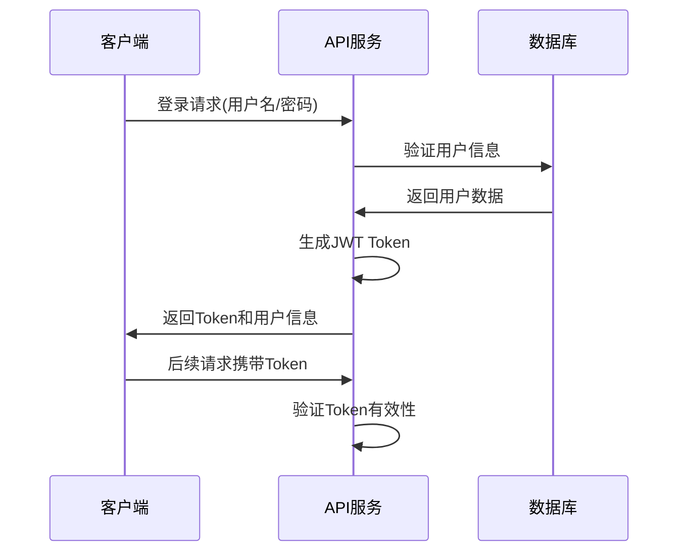

# Cursor Rules 网站技术方案

## 1. 概述

### 1.1 项目简介
Cursor Rules 是一个面向程序员和AI开发者的专业cursor规则分享平台，提供cursor rules文件的上传、管理、分享和下载功能。项目采用前后端分离架构，前端使用Vue.js 3.x，后端使用Python + FastAPI，数据库使用MySQL 8.0+。

### 1.2 技术架构
```
前端层 (Vue.js + Element Plus)
    ↓
API网关层 (FastAPI)
    ↓
业务逻辑层 (Python Services)
    ↓
数据访问层 (SQLAlchemy ORM)
    ↓
数据存储层 (MySQL 8.0+)
```

### 1.3 核心价值
- 为开发者提供cursor rules的集中管理平台
- 支持社区化的内容分享和评价机制
- 提供便捷的批量下载和分类管理功能

## 2. 需求分析

### 2.1 功能性需求

#### 2.1.1 用户管理需求
- **用户注册**：支持用户名+密码注册方式
- **用户认证**：基于JWT的登录认证机制
- **个人中心**：用户可管理自己发布的cursor rules

#### 2.1.2 内容管理需求
- **内容创建**：支持Markdown编辑器创建cursor rules
- **内容分类**：一级类目和多标签分类体系
- **内容编辑**：支持作者编辑自己的内容
- **内容删除**：支持作者删除自己的内容

#### 2.1.3 交互功能需求
- **评价系统**：支持点赞/点踩（无需登录）
- **浏览统计**：记录内容浏览和下载数量
- **搜索功能**：支持按标题、标签、分类搜索

#### 2.1.4 下载功能需求
- **单文件下载**：生成随机命名的ZIP包，包含单个.mdc文件
- **批量下载**：生成随机命名的ZIP包，包含多个.mdc文件
- **标准格式**：ZIP包解压后遵循`/.cursor/rules/文件名.mdc`结构

### 2.2 非功能性需求

#### 2.2.1 性能需求
- 页面加载时间 < 3秒
- API响应时间 < 500ms
- 支持100+并发用户访问

#### 2.2.2 安全需求
- 密码bcrypt加密存储
- JWT Token认证
- SQL注入和XSS攻击防护
- 文件名安全验证

#### 2.2.3 可用性需求
- 响应式设计，支持移动端
- 直观的用户界面
- 完善的错误提示

## 3. 现状分析

### 3.1 技术现状
- 项目为新建项目，无历史包袱
- 技术栈选择符合现代Web开发趋势
- 数据库设计已完成，关系清晰

### 3.2 市场现状
- 目前缺少专门的cursor rules分享平台
- 开发者社区对此类工具有需求
- 技术门槛适中，实现可行性高

## 4. 实现方案

### 4.1 架构设计

#### 4.1.1 整体架构
```
┌─────────────────┐    ┌─────────────────┐    ┌─────────────────┐
│   前端 Vue.js   │────│  后端 FastAPI   │────│  数据库 MySQL   │
│   - 用户界面    │    │   - API服务     │    │   - 数据存储    │
│   - 状态管理    │    │   - 业务逻辑    │    │   - 关系管理    │
│   - 路由管理    │    │   - 认证授权    │    │   - 索引优化    │
└─────────────────┘    └─────────────────┘    └─────────────────┘
```

#### 4.1.2 数据库设计
- **users**：用户信息表
- **categories**：一级分类表
- **tags**：标签表
- **cursor_rules**：cursor rules主表
- **cursor_rules_tags**：规则标签关联表
- **votes**：点赞点踩记录表

### 4.2 技术选型详细说明

#### 4.2.1 前端技术栈
- **Vue.js 3.x**：现代化响应式框架
- **Element Plus**：成熟的UI组件库
- **Vue Router 4**：官方路由管理
- **Pinia**：状态管理工具
- **Axios**：HTTP客户端
- **Monaco Editor**：代码编辑器

#### 4.2.2 后端技术栈
- **FastAPI**：高性能异步API框架
- **SQLAlchemy**：ORM框架
- **Alembic**：数据库迁移工具
- **python-jose**：JWT处理
- **passlib**：密码加密
- **python-multipart**：文件上传支持

#### 4.2.3 部署技术栈
- **Docker**：容器化部署
- **Nginx**：反向代理和静态资源服务
- **MySQL 8.0+**：关系型数据库

### 4.3 核心功能实现方案

#### 4.3.1 用户认证流程


#### 4.3.2 文件下载实现方案
```python
import zipfile
from io import BytesIO
import uuid
from fastapi.responses import StreamingResponse

# 单文件下载 - 也使用ZIP格式
def download_single(rule_id: int):
    rule = get_cursor_rule(rule_id)
    content = rule.content
    
    # 创建ZIP包
    zip_buffer = BytesIO()
    with zipfile.ZipFile(zip_buffer, 'w') as zip_file:
        zip_file.writestr(f".cursor/rules/{rule.filename}.mdc", content)
    
    zip_buffer.seek(0)
    
    # 生成随机文件名
    random_name = str(uuid.uuid4())[:8]
    zip_filename = f"cursor-rules-{random_name}.zip"
    
    return StreamingResponse(
        BytesIO(zip_buffer.read()), 
        media_type='application/zip',
        headers={"Content-Disposition": f"attachment; filename={zip_filename}"}
    )

# 批量下载
def download_batch(rule_ids: List[int]):
    zip_buffer = BytesIO()
    with zipfile.ZipFile(zip_buffer, 'w') as zip_file:
        for rule_id in rule_ids:
            rule = get_cursor_rule(rule_id)
            content = rule.content
            zip_file.writestr(f".cursor/rules/{rule.filename}.mdc", content)
    
    zip_buffer.seek(0)
    
    # 生成随机文件名
    random_name = str(uuid.uuid4())[:8]
    zip_filename = f"cursor-rules-batch-{random_name}.zip"
    
    return StreamingResponse(
        BytesIO(zip_buffer.read()), 
        media_type='application/zip',
        headers={"Content-Disposition": f"attachment; filename={zip_filename}"}
    )
```

#### 4.3.3 投票系统实现
```python
def vote_cursor_rule(rule_id: int, vote_type: str, ip_address: str):
    # 检查是否已投票
    existing_vote = session.query(Vote).filter_by(
        cursor_rule_id=rule_id, 
        ip_address=ip_address
    ).first()
    
    if existing_vote:
        if existing_vote.vote_type != vote_type:
            # 更新投票类型
            existing_vote.vote_type = vote_type
        else:
            # 取消投票
            session.delete(existing_vote)
    else:
        # 新增投票
        new_vote = Vote(cursor_rule_id=rule_id, vote_type=vote_type, ip_address=ip_address)
        session.add(new_vote)
    
    # 更新统计数据
    update_vote_counts(rule_id)
    session.commit()
```

## 5. 实现步骤

### 5.1 项目初始化 (第1周)
- [ ] 创建项目仓库和基础文件结构
- [ ] 配置开发环境和依赖管理
  - [ ] 前端：创建Vue项目，安装Element Plus等依赖
  - [ ] 后端：创建FastAPI项目，配置requirements.txt
  - [ ] 数据库：设计并创建数据库表结构
- [ ] 配置Docker和docker-compose开发环境
- [ ] 设置代码规范和Git工作流

### 5.2 后端API开发 (第2-3周)
- [ ] 数据库模型定义
  - [ ] 创建SQLAlchemy模型类
  - [ ] 配置数据库连接和会话管理
  - [ ] 编写数据库迁移脚本
- [ ] 用户认证系统
  - [ ] 实现用户注册接口
  - [ ] 实现用户登录接口
  - [ ] 实现JWT认证中间件
  - [ ] 实现用户信息接口
- [ ] Cursor Rules核心API
  - [ ] 实现CRUD接口（创建、读取、更新、删除）
  - [ ] 实现列表查询接口（支持分页、筛选）
  - [ ] 实现详情查询接口
  - [ ] 实现我的cursor rules接口
- [ ] 分类和标签API
  - [ ] 实现分类CRUD接口
  - [ ] 实现标签CRUD接口
  - [ ] 实现关联关系管理
- [ ] 下载功能API
  - [ ] 实现单文件下载接口
  - [ ] 实现批量下载接口
  - [ ] 实现文件格式化和ZIP打包
- [ ] 投票系统API
  - [ ] 实现点赞点踩接口
  - [ ] 实现投票统计更新
  - [ ] 实现IP地址去重逻辑

### 5.3 前端页面开发 (第4-5周)
- [ ] 项目架构搭建
  - [ ] 配置Vue Router路由
  - [ ] 配置Pinia状态管理
  - [ ] 配置Axios请求拦截器
  - [ ] 创建通用组件和工具函数
- [ ] 用户系统界面
  - [ ] 实现登录页面
  - [ ] 实现注册页面
  - [ ] 实现个人中心页面
  - [ ] 实现用户状态管理
- [ ] 主要业务页面
  - [ ] 实现首页列表展示
    - [ ] Cursor Rules卡片组件
    - [ ] 分页组件
    - [ ] 筛选和搜索组件
    - [ ] 批量选择和下载功能
  - [ ] 实现详情页面
    - [ ] Markdown内容渲染
    - [ ] 投票按钮组件
    - [ ] 相关推荐
  - [ ] 实现创建/编辑页面
    - [ ] Markdown编辑器集成
    - [ ] 富文本编辑器集成
    - [ ] 表单验证
    - [ ] 分类和标签选择器

### 5.4 集成测试和优化 (第6周)
- [ ] 前后端联调测试
  - [ ] API接口测试
  - [ ] 用户流程测试
  - [ ] 文件上传下载测试
- [ ] 性能优化
  - [ ] 数据库查询优化
  - [ ] 前端代码分割和懒加载
  - [ ] 静态资源优化
- [ ] 安全性测试
  - [ ] SQL注入测试
  - [ ] XSS攻击测试
  - [ ] 文件上传安全测试
- [ ] 用户体验优化
  - [ ] 响应式设计适配
  - [ ] 加载状态和错误处理
  - [ ] 用户引导和帮助文档

### 5.5 部署和上线 (第7周)
- [ ] 生产环境配置
  - [ ] Docker镜像构建和优化
  - [ ] Nginx配置
  - [ ] 数据库生产环境配置
- [ ] 部署脚本编写
  - [ ] CI/CD流水线配置
  - [ ] 自动化部署脚本
  - [ ] 监控和日志配置
- [ ] 上线前检查
  - [ ] 功能完整性检查
  - [ ] 性能基准测试
  - [ ] 安全扫描
  - [ ] 备份和恢复测试

## 6. 测试用例

### 6.1 用户认证测试用例

| 测试场景 | 测试步骤 | 预期结果 |
|---------|---------|---------|
| 用户注册 | 输入有效用户名和密码点击注册 | 注册成功，跳转到登录页 |
| 重复用户名注册 | 使用已存在用户名注册 | 显示用户名已存在错误 |
| 用户登录 | 输入正确用户名密码登录 | 登录成功，获得JWT Token |
| 错误密码登录 | 输入错误密码登录 | 显示用户名或密码错误 |
| Token过期处理 | 使用过期Token访问接口 | 返回401状态码，要求重新登录 |

### 6.2 Cursor Rules管理测试用例

| 测试场景 | 测试步骤 | 预期结果 |
|---------|---------|---------|
| 创建cursor rule | 填写完整信息提交 | 创建成功，返回详情页 |
| 必填字段验证 | 不填写标题提交 | 显示必填字段错误提示 |
| 文件名格式验证 | 输入包含特殊字符的文件名 | 显示文件名格式错误 |
| 编辑自己的内容 | 修改已创建的cursor rule | 修改成功，内容更新 |
| 删除自己的内容 | 删除已创建的cursor rule | 删除成功，列表中移除 |
| 访问他人内容编辑 | 尝试编辑他人创建的内容 | 返回403权限错误 |

### 6.3 下载功能测试用例

| 测试场景 | 测试步骤 | 预期结果 |
|---------|---------|---------|
| 单文件下载 | 点击单个cursor rule下载 | 下载随机命名的ZIP包，解压后包含.cursor/rules/文件名.mdc |
| 批量下载 | 选择多个文件批量下载 | 下载随机命名的ZIP包，解压后包含多个.mdc文件 |
| 文件内容验证 | 打开下载的ZIP包并解压 | 文件结构正确，路径为.cursor/rules/，内容为cursor rule的内容 |
| 空选择下载 | 未选择文件点击批量下载 | 显示请选择文件提示 |

### 6.4 投票系统测试用例

| 测试场景 | 测试步骤 | 预期结果 |
|---------|---------|---------|
| 首次点赞 | 点击点赞按钮 | 点赞数+1，按钮状态改变 |
| 取消点赞 | 再次点击点赞按钮 | 点赞数-1，按钮状态还原 |
| 切换投票类型 | 点赞后点击点踩 | 点赞数-1，点踩数+1 |
| 相同IP重复投票 | 同一IP多次投票 | 只记录最后一次投票 |

## 7. 风险评估

### 7.1 技术风险

| 风险项 | 风险等级 | 风险描述 | 应对措施 |
|--------|---------|----------|----------|
| Markdown编辑器集成 | 中 | 第三方编辑器可能存在兼容性问题 | 选择Monaco Editor等成熟方案，预留切换空间 |
| 大文件批量下载 | 中 | 大量文件打包可能导致性能问题 | 实现异步打包，添加文件数量限制 |
| 数据库性能 | 中 | 并发访问可能导致数据库压力 | 配置连接池，优化查询语句，添加缓存 |
| 文件存储 | 低 | 存储空间管理问题 | 设置文件大小限制，定期清理无效文件 |

### 7.2 业务风险

| 风险项 | 风险等级 | 风险描述 | 应对措施 |
|--------|---------|----------|----------|
| 内容质量控制 | 中 | 用户上传低质量或恶意内容 | 实现举报机制，管理员审核功能 |
| 恶意攻击 | 高 | SQL注入、XSS等安全攻击 | 严格输入验证，使用参数化查询，CSP策略 |
| 服务器资源滥用 | 中 | 恶意用户大量上传或下载 | 实现频率限制，IP黑名单机制 |
| 用户数据安全 | 高 | 用户密码泄露风险 | 使用bcrypt加密，定期安全审计 |

### 7.3 项目风险

| 风险项 | 风险等级 | 风险描述 | 应对措施 |
|--------|---------|----------|----------|
| 开发进度延期 | 中 | 技术难点可能导致开发延期 | 合理评估工作量，预留缓冲时间 |
| 需求变更 | 中 | 开发过程中需求可能发生变化 | 与需求方保持沟通，采用敏捷开发方式 |
| 团队协作 | 低 | 前后端开发协作问题 | 定义清晰的API文档，定期沟通 |

## 8. 待确认列表

### 8.1 功能需求待确认
- [ ] **文件大小限制**：单个cursor rule内容的最大长度限制？
- [ ] **用户权限管理**：是否需要管理员角色和后台管理功能？
- [ ] **内容审核机制**：是否需要内容发布前审核？
- [ ] **搜索功能范围**：搜索是否包含内容正文，还是仅标题和标签？
- [ ] **社交功能扩展**：是否需要评论、收藏、关注等功能？

### 8.2 技术实现待确认
- [ ] **缓存策略**：Redis缓存是否需要引入？缓存哪些数据？
- [ ] **文件存储方案**：是否考虑对象存储（如阿里云OSS）？
- [ ] **邮件通知**：是否需要邮件验证和通知功能？
- [ ] **日志管理**：日志收集和分析方案选择？
- [ ] **监控告警**：系统监控和告警机制如何配置？

### 8.3 部署运维待确认
- [ ] **服务器配置**：生产环境服务器规格和配置要求？
- [ ] **域名和SSL**：域名申请和SSL证书配置？
- [ ] **备份策略**：数据库备份频率和保留策略？
- [ ] **CDN配置**：是否需要CDN加速静态资源？
- [ ] **版本发布策略**：蓝绿部署还是滚动更新？

### 8.4 业务运营待确认
- [ ] **初始数据**：是否需要预置一些示例cursor rules？
- [ ] **用户引导**：新用户注册后的引导流程？
- [ ] **数据统计**：需要统计哪些运营数据？
- [ ] **SEO优化**：是否需要考虑搜索引擎优化？
- [ ] **多语言支持**：是否需要国际化支持？

---

**技术方案版本**: v1.0  
**创建日期**: 2024年12月  
**预计开发周期**: 7周  
**技术负责人**: 待确认 